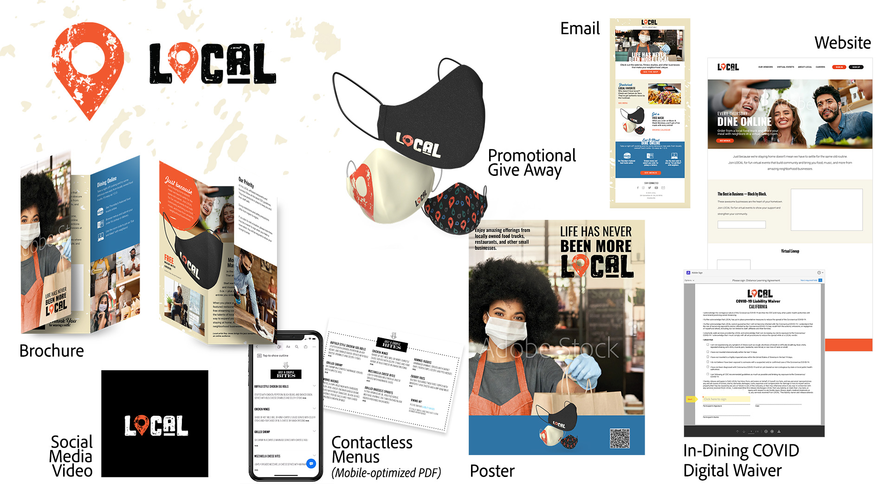

# MAX 2020 — the Enterprise Sessions

## About the Demo Assets: LOCAL

The team approached creating the demo assets as an enterprise might. We envisioned a campaign and created assets for various channels. We also created a CC Library of brand elements to support collaboration and consistency. 

In response to COVID-19, LOCAL, a company that hosts live events that celebrate fun, wacky holidays has pivoted to online gatherings and is partnering with small, local food trucks and restaurants to promote their businesses—and help them stay open.

