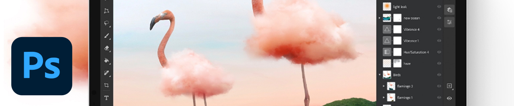

# Photoshop on iPad

Photoshop is the world’s best imaging and graphic design software, allowing unlimited creativity for professionals across devices. Now anyone can create anything they imagine, anywhere inspiration strikes. If you can think it, you can make it with Photoshop.

## Browse Product Tutorials

<table>
<tr>
 <td>
   
    

   <a href="photoshopipad.md#tutorial1"><strong>Intro to Photoshop on the iPad</strong></a>
    

    <em>Insert description</em>
     
  </td>
  <td>
    
    

     
  </td>
  <td>
    
    

     
  </td>
</tr>
</table>

## Intro to Photoshop on the iPad {#tutorial1}

**Description**

Insert description

In this tutorial, you will learn how to:
* 
* 
* 

**Presented by:**

A.J. Wood, Solution Consultant (Digital Media)